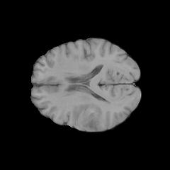
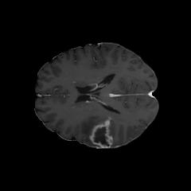
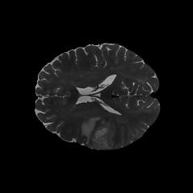

# Tumour Detection and Segmentation from Multi-Sequence 2D Brain MRI Slices (UCSF-PDGM)

|                          |                          |                          |
|------------------------|------------------------|------------------------|
|  |  |  |

## Problem

To detect and localise tumours in preoperative MRI scans of patients with brain cancer. Split into two stages to first detect if there is a tumour present in the image slices followed by locating the tumour on the brain image slice.

1.  Classification:
    -   Detections of tumour in each slice using `is_tumorous`
2.  Segmentation:
    -   Pixel localisation using `tumor_mask`.

## Data Structure

### Dataset

| Field         | Description                                      |
|---------------|--------------------------------------------------|
| `volume_id`   | Unique patient identifier                        |
| `slice_id`    | Index of slice of MRI (155 slices)               |
| `t1`          | 2D Pre-contrast T1 weighted MRI slice            |
| `t1c`         | 2D Post-contrast T1 weighted MRI slice           |
| `t2`          | 2D T2 weighted MRI slice                         |
| `tumor_mask`  | 2D tumor segmentation mask                       |
| `is_tumorous` | Whether any tumour label is present on the slice |
| `tumor_type`  | Final diagnosis                                  |
| `who_grade`   | WHO tumour grade                                 |
| `sex`         | Patient sex M or F                               |
| `age`         | Patient age at MRI                               |

All patients have a confirmed diagnosis, after removing missing values there is 414 patients x 155 slices = 64170 slices. `is_tumorous` varies per slice with 38,715 no tumour slices and 25,455 tumour slices. Each slice comes with three MRI sequences (`t1`, `t1c`, `t2`) as well as a `tumor_mask` for segmentation.

[UCSF_PDGM Dataset](https://huggingface.co/datasets/chehablab/UCSF_PDGM) - Hugging Face

|  |  |
|-------------|----------------------------------------------------------|
| Author | Calabrese, E. and Villanueva-Meyer, J. and Rudie, J. and Rauschecker, A. and Baid, U. and Bakas, S. and Cha, S. and Mongan, J. and Hess, C. |
| Title | The University of California San Francisco Preoperative Diffuse Glioma MRI (UCSF-PDGM) (Version 5) \[dataset\] |
| Year | 2022 |
| Publisher | The Cancer Imaging Archive |
| DOI | 10.7937/tcia.bdgf-8v37 |

: Calabrese2022

## Repository Structure

```         
|-- /Tumour
    |-- README.md                                   # Project overview and dataset summary
    |-- requirements.txt                            # Python dependencies
    |-- images/                                     # Project images
    |-- /baseline_accuracy                          # Baseline model notebooks
        |-- logistic_accuracy.ipynb                 # Classification baseline experiments
        |-- mask_accuracy.ipynb                     # Segmentation baseline experiments
    |-- /methods                                    # Data loading and helper methods
        |-- load_data.py                            # Loads, cleans and splits dataset
        |-- logistic_flatten.py                     # Flattening methods for logistic baselines
        |-- visualisation.py                        # Plotting and visualisation helpers
    |-- /models                                     # Trained models and training notebooks
        |-- best_classification_model.keras         # Keras file of classification model
        |-- best_segmentation_model.keras           # Keras file of segmentation model
        |-- classification_model.ipynb              # Classification model training notebook
        |-- combined_model.ipynb                    # Combined pipeline notebook
        |-- finetuned_classification_model.keras    # Keras file of finetuned model
        |-- finetuning_classification_model.ipynb   # Finetuning classification model with imagenet and augmentation
        |-- segmentation_model.ipynb                # Segmentation model training notebook
```