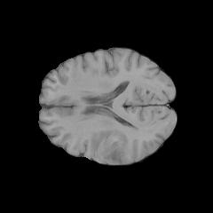

# Tumour Detection and Segmentation from Multi-Sequence 2D Brain MRI Slices (UCSF-PDGM)

|                          |                          |                          |
|------------------------|------------------------|------------------------|
|  |  |  |

## Goal

This goal of this project is to help speed up how radiologists review brain MRI scans for brain tumour patients. Each patient's scan is made up of 155 slices, so manually scanning through all of them to find where the tumour is visible takes time. The model will address this in two steps: classifying which slices contain visible tumour tissue and generating a mask showing where the tumour is on the flagged slices.

## Data Structure

### Source

[UCSF_PDGM Dataset](https://huggingface.co/datasets/chehablab/UCSF_PDGM) - Hugging Face

### Size

All 501 patients in the dataset, each with 155 MRI slices, gives 77,650 total 2D slices. Each slice includes three MRI sequences (`t1`, `t1c`, `t2`), a flag for if the slice `is_tumorous` and a segmentation mask (`tumor_mask`). Since metadata fields will be excluded (`age`, `sex`, `tumor_type`, `who_grade`) from the model inputs, the full patient data is usable as null values only occur in these columns.

### Train / Val / Test

Split by patient (`volume_id`) rather than by slice (`slice_id`) since each patients 155 slices are highly correlated and a slice level split would leak information across sets. Roughly 250 patients in the training set and 125 patients in the validation and test sets respectively.

### License / Ethics

TCIA data is released for research use under its own CC by 4.0 license. No new labels are being created as they are already provided in the dataset, however deployment would require formal clinical validation and ethical review before it could be extended onto unseen MRI slices outside of the dataset.

|  |  |
|-------|-----------------------------------------------------------------|
| Author | Calabrese, E. and Villanueva-Meyer, J. and Rudie, J. and Rauschecker, A. and Baid, U. and Bakas, S. and Cha, S. and Mongan, J. and Hess, C. |
| Title | The University of California San Francisco Preoperative Diffuse Glioma MRI (UCSF-PDGM) (Version 5) \[dataset\] |
| Year | 2022 |
| Publisher | The Cancer Imaging Archive |
| DOI | 10.7937/tcia.bdgf-8v37 |

: Calabrese2022

## Approach

### Classification Stage

A small ConvNet taking `t1`, `t1c` and `t2` as input channels, predicting tumour presence on each image slice. Instead of max pooling, it will used strided convolutions to reduce spatial dimensions while extracting features, which better preserves the spatial structure that is relevant to tumour location. Ending in a single output predicting the probability that the slice contains a visible tumour (`is_tumorous`).

### Segmentation Stage

A U-Net, applied only to slices flagged with tumours by the classification stage. It used an encoder-decoder structure where the encoder reduces spatial resolution using strided convolutions rather than max pooling, while the decoder builds up the resolution to produce a tumour mask, using the provided `tumor_mask` to validate the accuracy of the segmentation.

## Success Criteria

### Primary Metrics

-   Classification: AUC (Area Under Curve)

-   Segmentation: IOU (Intersection Over Union)

### Naive Baseline to Beat

For classification: After running logistic regression on the scaled metadata (`age`, `sex`, `slice_id`), flattened pixels (`t1`, `t1c`, `t2`) and the combination of metadata and pixels. The pixel data alone is sufficient enough to predict `is_tumorous` and allows for the inclusion of the full dataset as null values are only in the metadata columns.

For segmentation: A baseline of an average `tumor_mask` across the training set across all positive tumour images. Calculating the IoU using the average mask to predict the baseline accuracy on the training data.

## Risks & Scope

The primary risk is data leakage. The splitting of the data must be done at the patient level, as each patient has 155 slices, this must be split by `volume_id` not `slice_id` to prevent overestimation of accuracy. `tumor_type` and `who_grade` will also be excluded from the model input features as these are consistent across whole patient information rather than on the individual slices and contains null values on some patients.

### What Will Not Be Done If Time Runs Short

-   The project will use a single CNN for classification and a single U-Net for segmentation, rather than combining the models.

-   The model will predict a single binary tumour vs background `tumor_mask` rather than separately segmenting different tumour types (edema, enhancing tumour, necrotic core) as distinct classes.